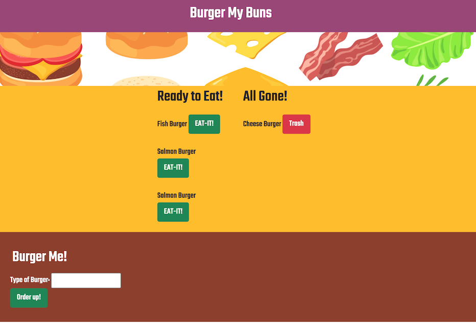

# Burger.Buns

[](https://opensource.org/licenses/MIT)
      
     
## Description

An application that tracks and saves Burger ensembles.  This application can help with organizing specific customer orderes. Technologies used: MySQL, Node, Express, Handlebars, ORM.

## Table of Contents
 
* [Installation](#installation)
* [Usage](#usage)
* [License](#license)
 
## Installation
```
npm i
``` 

## Usage
 

## License
This project is covered under the MIT License.
 

## Questions
- [Email](lee.amber.alex@gmail.com)
- [Github Page](https://github.com/lee-amber-alex)
 
